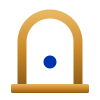
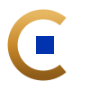

# Cella — brand assets

Portable brand kit for **Cella** and the wider **Cardano Curia** identity. The full
specification — color tokens, typography, and components — lives in
[`BRAND.md`](BRAND.md); treat this page as the quick visual index.

The identity is deliberately **Roman / classical** — inscription-on-stone, gold leaf,
Cardano blue — to stake out a warm, civic niche away from the cool-blue "another
protocol" crowd. Tagline: *Integritas ante omnia* ("Integrity above all").

## Logo marks

Two directions, each in four finishes. (Shown below on light backgrounds; the
`ivory-forum` finish is white-on-navy for dark UI and isn't previewed here.)

### Aedicula — the temple niche

  
  &nbsp;&nbsp;
  
  &nbsp;&nbsp;
  

### Chamber — the "C" monogram

  
  &nbsp;&nbsp;
  
  &nbsp;&nbsp;
  

## Choosing a finish

| Context | Finish | File suffix |
|---|---|---|
| Light background, ≥64px (primary) | Textured gold leaf | `-gold-leaf` |
| Small — favicons, app icons (<64px) | Solid gold | `-gold-solid` |
| One-color — print, emboss, etch | Ink | `-ink` |
| Dark UI (e.g. login / footer) | Ivory on forum-navy | `-ivory-forum` |

## Contents

- **`logo/`** — the 8 production SVG marks (`cella-{aedicula,chamber}-{gold-leaf,gold-solid,ink,ivory-forum}.svg`).
- **`BRAND.md`** — full brand specification: color tokens, typography (Cinzel / EB Garamond / Inter / JetBrains Mono), and component primitives.
- **`_source/`** — editable design-tool originals for the logo and brand sheet (open the `.dc.html` files in the design app).
